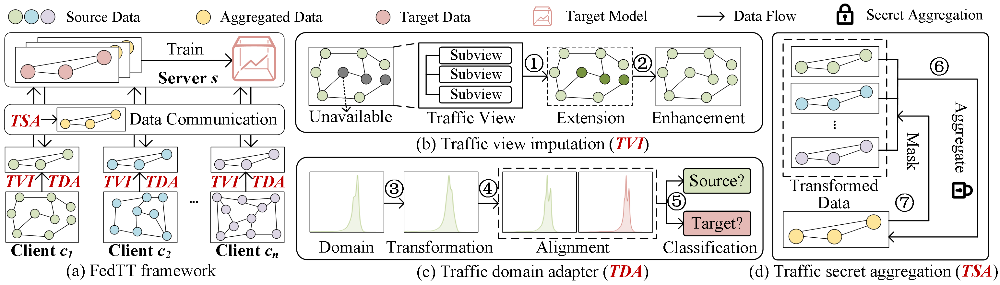

# FedTT

Traffic prediction aims to forecast future traffic conditions using historical traffic data, serving a crucial role in urban computing and transportation management. While transfer learning and federated learning have been employed to address the scarcity of traffic data by transferring traffic knowledge from data-rich to data-scarce cities without traffic data exchange, existing approaches in Federated Traffic Knowledge Transfer (FTT) still face several critical challenges such as potential privacy leakage, cross-city data distribution discrepancies, and low data quality, hindering their practical application in real-world scenarios. To this end, we present FedTT, a novel privacy-aware and efficient federated learning framework for cross-city traffic knowledge transfer. Specifically, our proposed framework includes four key innovations: (i) a traffic view imputation method for missing traffic data completion to enhance data quality, (ii) a traffic domain adapter for uniform traffic data transformation to address data distribution discrepancies, and (iii) a traffic secret aggregation protocol for secure traffic data aggregation to safeguard data privacy. Extensive experiments on 4 real-world datasets demonstrate that the proposed FedTT framework outperforms the 14 state-of-the-art baselines.



## ⚙️ Environment

Python.version = 3.9.21

Other dependencies are listed in requirements.txt.

All the experiments are conducted in the federated environment on four nodes, one as a server and the other three as clients, each equipped with two Intel(R) Xeon(R) CPU E5-2650 v4@2.20GHz 12-core processors, 128GB of RAM, and a Internet speed of 100MB/s.

## 🌍 Datasets

In this paper, we used 4 public datasets including PeMSD4, PeMSD8, FT-AED, HK-Traffic. The statistics of dataset as detailed below:

|                           Dataset                            | # instances | # sensors | Interval |      City      | Missing Rate |
| :----------------------------------------------------------: | :---------: | :-------: | :------: | :------------: | :----------: |
|     [PeMSD4](https://paperswithcode.com/dataset/pemsd4)      |   16,992    |    307    |  5 min   | San Francisco  |    16.35%    |
|     [PeMSD8](https://paperswithcode.com/dataset/pemsd8)      |   17,856    |    170    |  5 min   | San Bernardino |    20.09%    |
|        [FT-AED](https://acoursey3.github.io/ft-aed/)         |    1,920    |    196    |  5 min   |   Nashville    |    4.59%     |
| [HK-Traffic](https://data.gov.hk/en-data/dataset/hk-td-sm_4-traffic-data-strategic-major-roads) |   17,856    |    411    |  5 min   |   Hong Kong    |    13.01%    |

## 🛠️ Running

The running example of FedTT is as follows.

````
python main.py --address 'localhost' --batch_size 128 --clients_num 3--device 'cuda' --epoch 100 --frozen 5 --learning_rate 0.005 --model 'mlp' --task 'flow' --test_split 0.1 --time_step 12 --train_split 0.8 --val_split 0.1
